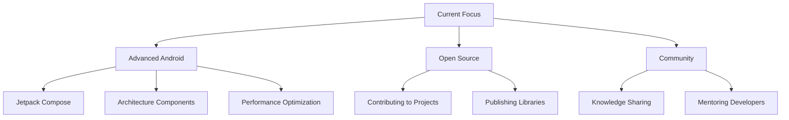

#  Yo! I'm Sayem – Code Wizard in Progress ✨

<div align="center">
  
</div>

<div align="center">
  
</div>

## 💁 About Me

```kotlin
class AndroidDeveloper {
    val name = "SM Sayem Hossain"
    val age = 19
    val location = "Dhaka, Bangladesh 🇧🇩"
    val university = "Daffodil International University (DIU)"
    val languages = listOf("Java", "Kotlin", "JavaScript", "HTML", "CSS")
    val focus = "Building Android apps that help people every day"
    val motto = "Code with purpose, build with passion"
    
    fun getCurrentStatus(): String {
        return "Crafting innovative Android solutions 📱"
    }
    
    fun getGoals(): List<String> {
        return listOf(
            "Master advanced Android architecture patterns",
            "Contribute to open-source projects",
            "Help fellow developers grow",
            "Build apps that make a difference"
        )
    }
}
```

<div align="center">
  
</div>

## 🎯 What I'm All About

<table align="center">
<tr>
<td width="50%">

### 🔥 Current Focus
- 📱 **Android Development** with modern tools
- ☕ **Java & Kotlin** mastery
- 🏗️ **Clean Architecture** implementation
- 🚀 **Performance Optimization**
- 🔧 **Code Quality** & best practices

</td>
<td width="50%">

### 🌟 My Approach  
- 💡 **Problem-solving** first mindset
- 🎨 **User-centric** design thinking
- 📚 **Continuous learning** culture
- 🤝 **Collaborative** development
- 🔍 **Detail-oriented** execution

</td>
</tr>
</table>

## 🛠️ Tech Arsenal

<div align="center">

### 💻 Languages & Frameworks


### 📱 Mobile & Tools


</div>

<div align="center">
  
</div>

## 📊 GitHub Analytics

<div align="center">
  
  
</div>

<div align="center">
  
</div>

## 🏆 Achievements & Recognition

<div align="center">
  
</div>

<div align="center">
  
</div>

## 📈 Contribution Graph

<div align="center">
  
</div>

## 🌟 Featured Work

<div align="center">

### 🔥 Repository Highlights

<a href="https://github.com/sm-sayem-hossain?tab=repositories">
  
</a>

</div>

<table align="center">
<tr>
<td width="50%">

### 📱 Mobile Excellence
- **Clean Architecture** implementations
- **MVVM & MVP** patterns
- **Room Database** integrations
- **RESTful API** consumption
- **Material Design** UI/UX

</td>
<td width="50%">

### 🚀 Innovation Focus
- **Performance** optimization
- **Security** best practices
- **Testing** methodologies
- **CI/CD** workflows
- **Code documentation**

</td>
</tr>
</table>

## 📡 Let's Connect!

<div align="center">

### 🌐 Find Me Around The Web

[](mailto:your.email@gmail.com)
[](https://linkedin.com/in/yourprofile)
[](https://instagram.com/yourhandle)
[](https://medium.com/@yourhandle)
[](https://t.me/yourhandle)
[](https://wa.me/yournumber)

</div>

<div align="center">
  
</div>

## 🗺️ My World

```javascript
const sayem = {
    fullName: "SM Sayem Hossain",
    age: 19,
    location: {
        city: "Dhaka",
        country: "Bangladesh 🇧🇩",
        timezone: "UTC +06:00",
        coordinates: "23.8103°N, 90.4125°E"
    },
    education: {
        university: "Daffodil International University",
        shortForm: "DIU",
        status: "Student"
    },
    workingHours: "Flexible, but usually 9 AM - 6 PM BDT",
    languages: ["Bengali (Native)", "English (Fluent)", "Hindi (Conversational)"],
    interests: ["Mobile Development", "UI/UX Design", "Tech Innovation", "Open Source"]
};
```

## 💼 Professional Services

<div align="center">

| Service | Description | Status |
|---------|-------------|--------|
| 📱 **Android App Development** | Custom mobile solutions | ✅ Available |
| ☕ **Java Applications** | Desktop & backend development | ✅ Available |
| 🎯 **Kotlin Programming** | Modern Android development | ✅ Available |
| 🔧 **Code Review** | Quality assurance & optimization | ✅ Available |
| 🚀 **Technical Consultation** | Architecture & best practices | ✅ Available |
| 📚 **Mentorship** | Helping fellow developers | ✅ Available |

</div>

## 🎯 Current Goals & Learning

<div align="center">



</div>

## 📊 Weekly Development Breakdown

```text
Java/Kotlin   ████████████████████████▒   85.2% 
XML/HTML      ████▒░░░░░░░░░░░░░░░░░░░░   08.7% 
CSS           ██░░░░░░░░░░░░░░░░░░░░░░░   04.1% 
JavaScript    █░░░░░░░░░░░░░░░░░░░░░░░░   02.0% 
```

## 💭 Philosophy

<div align="center">
  
</div>

<div align="center">

### 🌟 My Developer Mantra

> *"Great apps are not built overnight, but with consistent effort, passion for problem-solving, and a commitment to user experience. Every line of code is an opportunity to make someone's life better."*

</div>

## 📈 Profile Analytics

<div align="center">
  


</div>

---

<div align="center">
  
</div>

<div align="center">

### 🚀 Ready to Build Something Amazing Together?


*Building the future, one commit at a time* ⚡

</div>

<div align="center">
  
</div>
